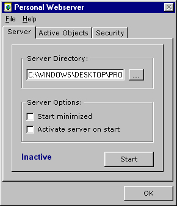



## Personal Webserver

### Description

This is the most advanced webserver on Planet Source Code! This is an update to the webserver

programmed by Pat (and updated by Joox). It now supports CGI scripts! The ability of banning certain unwanted visitors! The ability to temporarily the server. Unlimited file download size! New security features! Many new misc. features and a new GUI to go along with them! I hope this code goes to good use! Please report any bugs (I want feedback!!!).
 
### More Info
 

             |
---                |---
**Submitted On**   |2000-02-27 20:16:20
**By**             |[James Simmons](https://github.com/Planet-Source-Code/PSCIndex/blob/master/ByAuthor/james-simmons.md)
**Level**          |Advanced
**User Rating**    |4.6 (125 globes from 27 users)
**Compatibility**  |VB 5\.0, VB 6\.0
**Category**       |[Internet/ HTML](https://github.com/Planet-Source-Code/PSCIndex/blob/master/ByCategory/internet-html__1-34.md)
**World**          |[Visual Basic](https://github.com/Planet-Source-Code/PSCIndex/blob/master/ByWorld/visual-basic.md)
**Archive File**   |[CODE\_UPLOAD36692272000\.zip](https://github.com/Planet-Source-Code/james-simmons-personal-webserver__1-6299/archive/master.zip)

